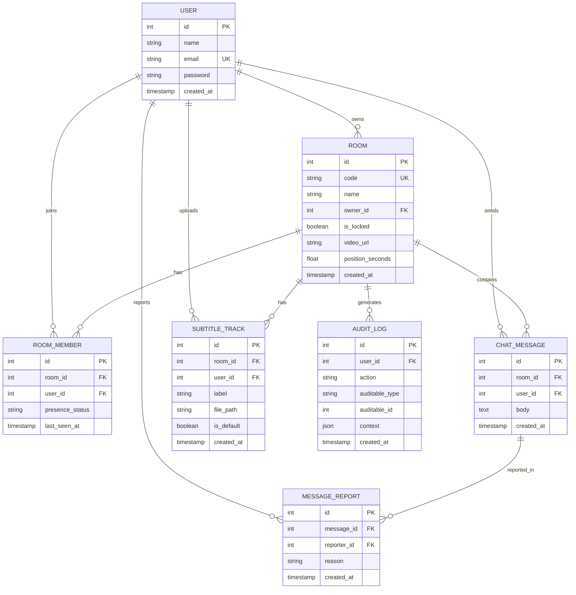

# Database Schema

## Entity Relationship Diagram

## Table Descriptions

### users
Authenticated users. Guest users are created temporarily for anonymous room joins.

### rooms
Watch-party rooms. Each room has a unique 6-character code for sharing.

### room_members
Junction table for users in rooms. Tracks presence status (online/offline) and last heartbeat.

### chat_messages
Chat messages within a room. Soft-deleted when removed by owner/moderator.

### message_reports
User-submitted reports for inappropriate messages. Unique constraint prevents duplicate reports.

### subtitle_tracks
Uploaded subtitle files (SRT/VTT) for a room. One can be marked as default.

### audit_logs
Immutable log of sensitive actions (delete, kick, transfer, report, settings change) for security forensics.
